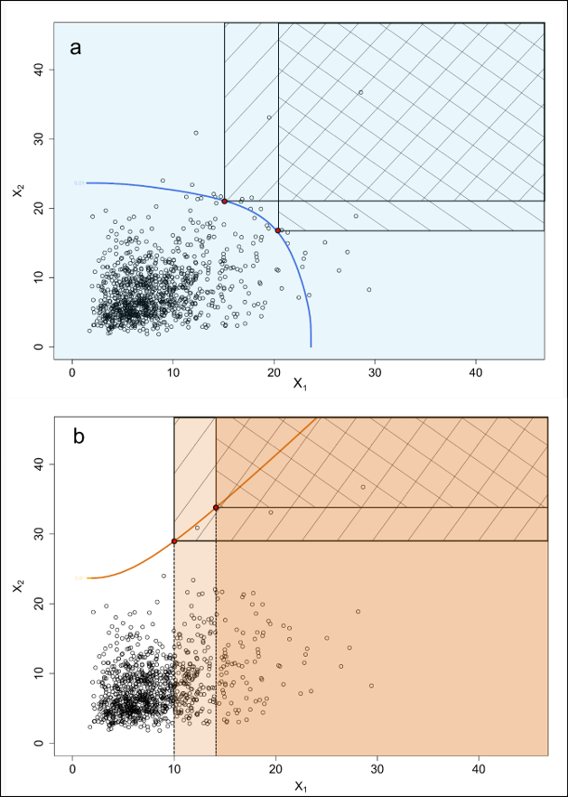

<!-- README.md is generated from README.Rmd. Please edit that file -->

# mobirep : Models Bivariate Dependence and Produces Bivariate Return Periods


<!-- badges: start -->

[](https://cran.r-project.org/package=mobirep)

 [](https://lifecycle.r-lib.org/articles/stages.html#experimental)
[](https://makeapullrequest.com/)
<!-- badges: end -->


## Installation

You can install the released version of mobirep from
[CRAN](https://CRAN.R-project.org) with:

``` r
install.packages("mobirep")
```

## Description

This package allows to model the dependence between two variables in the
extremes, and identifies most relevant models among six models: the
conditional extremes model, the Jt-KDE model and four copulae (Gumbel,
Galambos, Normal, FGM). two types of bivariate return periods for the
six models and can be produced:

-   Joint return period (compound)
-   Conditional return period (cascade)

<figure>
<figcaption aria-hidden="true">Types of Return Periods</figcaption>
</figure>

Methods used in the package are described in the following reference:
Tilloy, Malamud, Winter and Joly-Laugel (2020)
<https://nhess.copernicus.org/articles/20/2091/2020/nhess-20-2091-2020.html>
Supporting references for the conditional extremes model, Jt-KDE model
and for copula modelling are the following:

-   Heffernan and Tawn (2004)
    <https://doi.org/10.1111/j.1467-9868.2004.02050.x>

-   Cooley, Thibaud, Castillo and Wehner (2019)
    <a href="https://doi:10.1007/s10687-019-00348-0" class="uri">https://doi:10.1007/s10687-019-00348-0</a>

-   Nelsen (2006)
    <a href="https://doi:10.1007/0-387-28678-0" class="uri">https://doi:10.1007/0-387-28678-0</a>.
